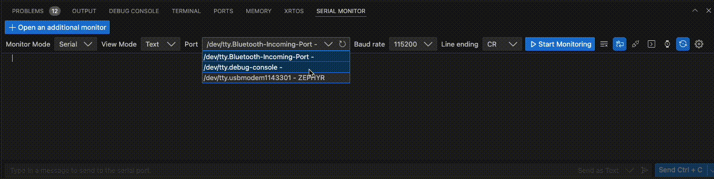

# Zephyr Example Application

- workspace application type (`app`) that showcases some basics such as:
  - usage of the `shell` module and `CLI` commands
  - setting GPIO output (built-in LED)
  - device tree overlay definition
  - project config - setup of USB/UART communication etc.
  - usage of logging
- this example application follows T2 topology as described [here](https://docs.zephyrproject.org/latest/develop/getting_started/index.html)
- tested using:
  - Raspberry Pi Pico 1 (RP 2040)
  - macOS Sequoia 15.0.1
  - VS Code Version: 1.94.2

# Build

- navigate to the directory where you want to clone the repo and: `west init -m https://github.com/krystofh/zephyr-demo --mr main zephyr-demo`
  - if you installed west using Python virtual environment, make sure you activate it before like `source zephyr-demo/zephyr/.venv/bin/activate` 
- see [getting started guide](https://docs.zephyrproject.org/latest/develop/getting_started/index.html) which describes setup for `repository` applications/samples
- Build with `west build -b rpi_pico app` in the `zephyr-demo` subdirectory
- The `.uf2` file is located in `zephyr-demo/build/zephyr`

# Demonstration

## Useful links and hints

- Using USB serial communication https://www.gnd.io/zephyr-console-output/ 
  - Contrary to the article, one has to specify the overlay in `rpi_pico.overlay` as it has priority over `app.overlay`. Read more [here](https://docs.zephyrproject.org/3.3.0/build/dts/howtos.html#set-devicetree-overlays)
- Configure device as CDC (Communication device class) using ACM (abstract control module) https://docs.zephyrproject.org/latest/connectivity/usb/device/usb_device.html#cdc-acm
- Building the `shell_module` with USB console, use command: `west build -b rpi_pico -S cdc-acm-console -p always zephyr/samples/subsys/shell/shell_module`
- When using the shell, set line ending to `CR`